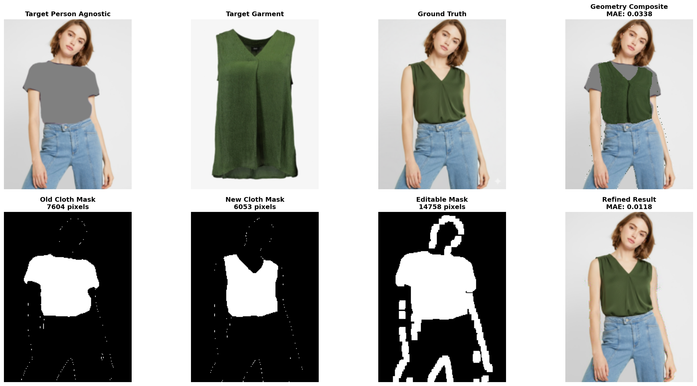

AI Virtual Try-On (VTON): Developed a flow-based + CNN hybrid model for realistic garment transfer on human images with high visual fidelity.
Optimized inference pipeline achieving ~300 ms latency for near real-time performance.
Focused on preserving pose, texture, and occlusion handling for practical fashion-tech applications.

